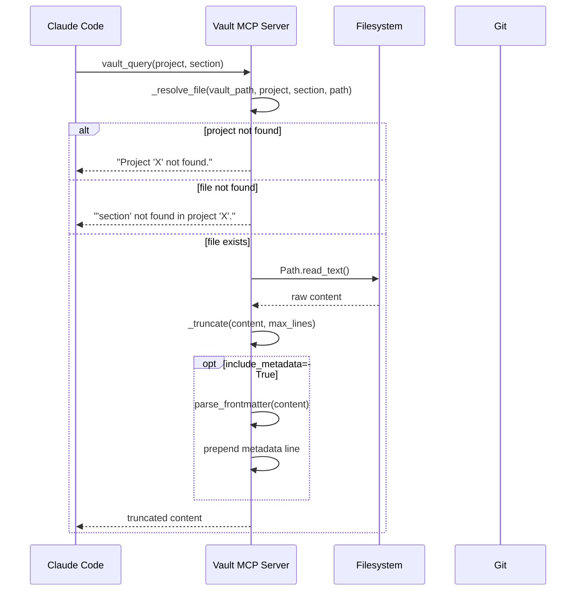
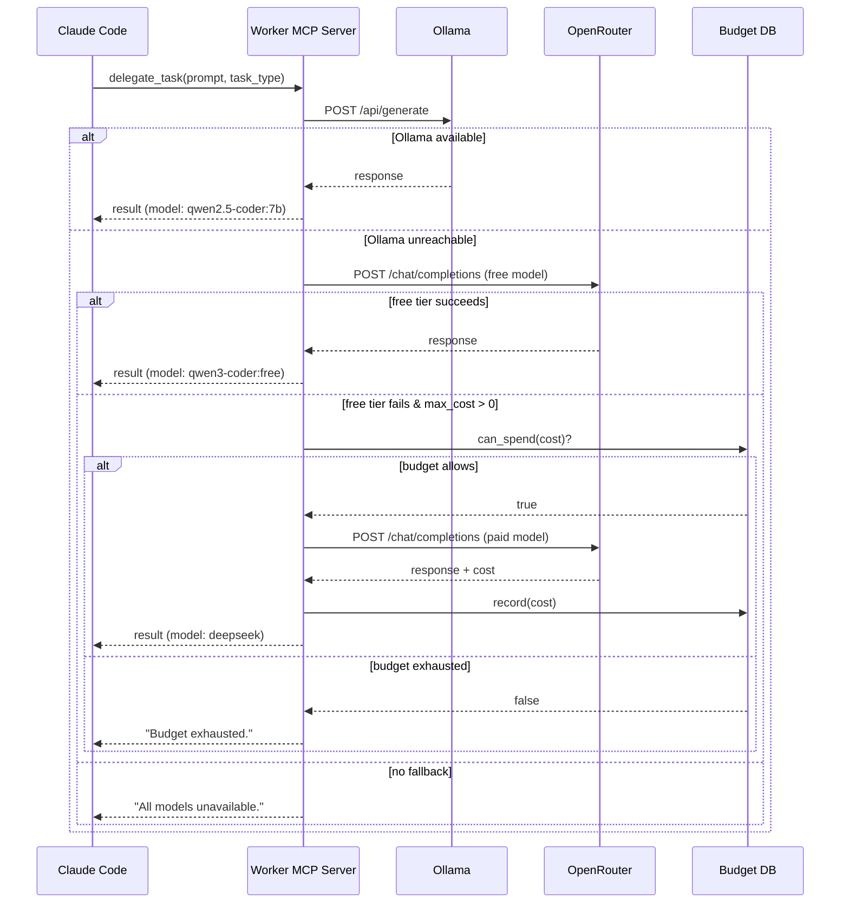
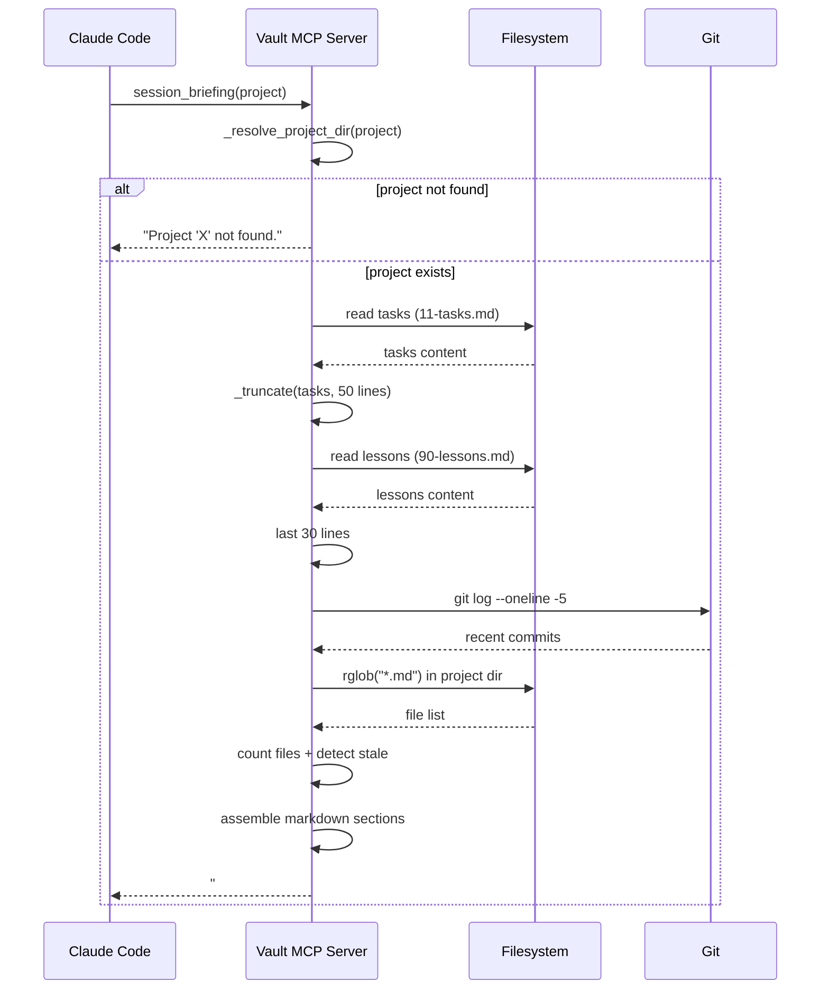
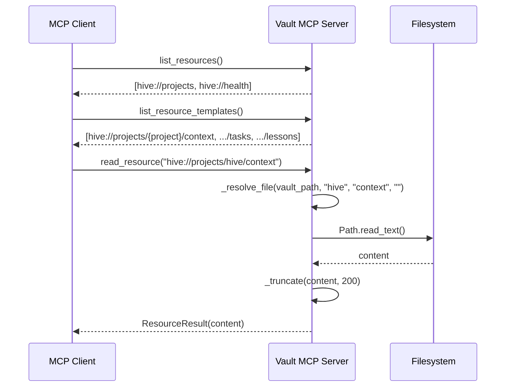
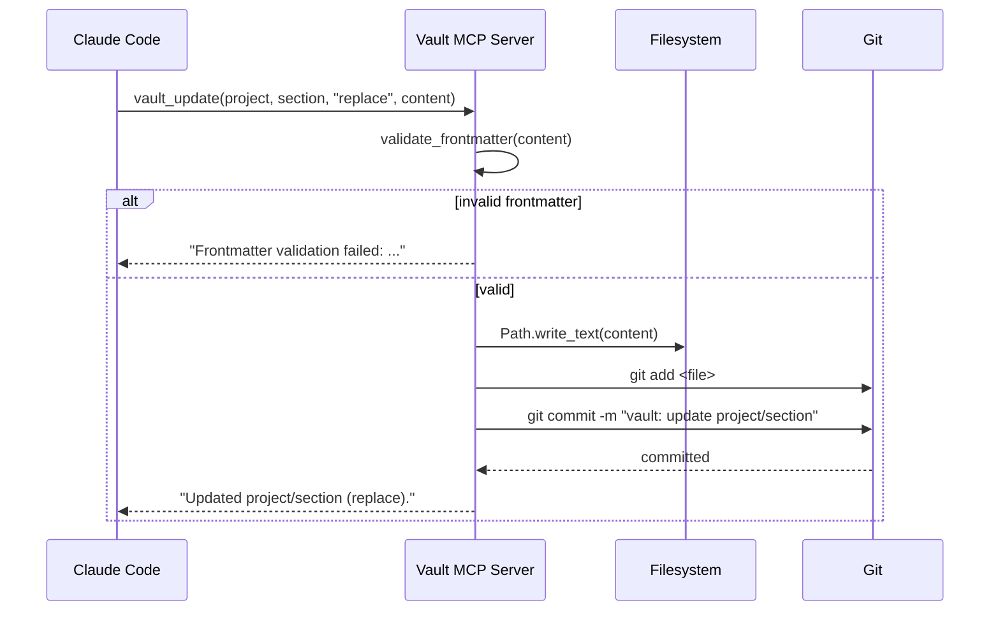
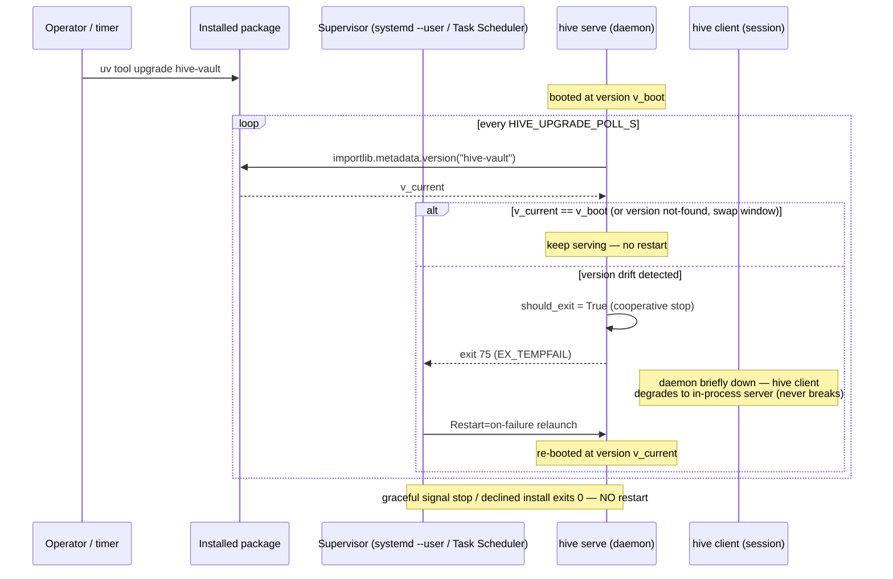

# Hive: Sequence Diagrams

> End-to-end flows for the three primary interaction patterns.
> Rendered by Obsidian or any Mermaid-compatible viewer.

## 1. Vault Query Flow

Standard read path — covers `vault_query`, `vault_search`, `vault_smart_search`.

## 2. Worker Delegation Flow

Task delegation with 3-tier routing and budget control.

## 3. Session Briefing Flow

One-call cold-start that replaces 3–4 manual tool calls.

## 4. Resource Discovery Flow

MCP clients discovering vault content without knowing tool names.

## 5. Vault Write Flow

Write path with frontmatter validation and atomic git commit.

## 6. Restart-on-Upgrade Flow (Daemon Mode)

How a supervised `hive serve` adopts a newer published version without a manual
restart — the exit-75 / `Restart=on-failure` contract behind daemon auto-update
(ADR-011). See the [daemon mode guide](../../site/src/content/docs/guides/daemon-mode.md).

